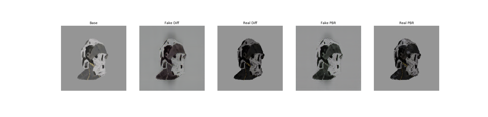

# Physically Based Rendering through Generative Adversarial Network
Stanford CS221 Artificial Intelligence: Principles and Techniques 2019 Fall Project

### [gan](https://github.com/jjbits/PBRGAN/tree/master/gan)
CyclGan based renderer

### [renderer](https://github.com/jjbits/PBRGAN/tree/master/renderer)
PBR 3D renederer

[The term paper here.](https://drive.google.com/open?id=1-xfheHPphIFqxxBBZNGPK8qzKhNvGiNa)

